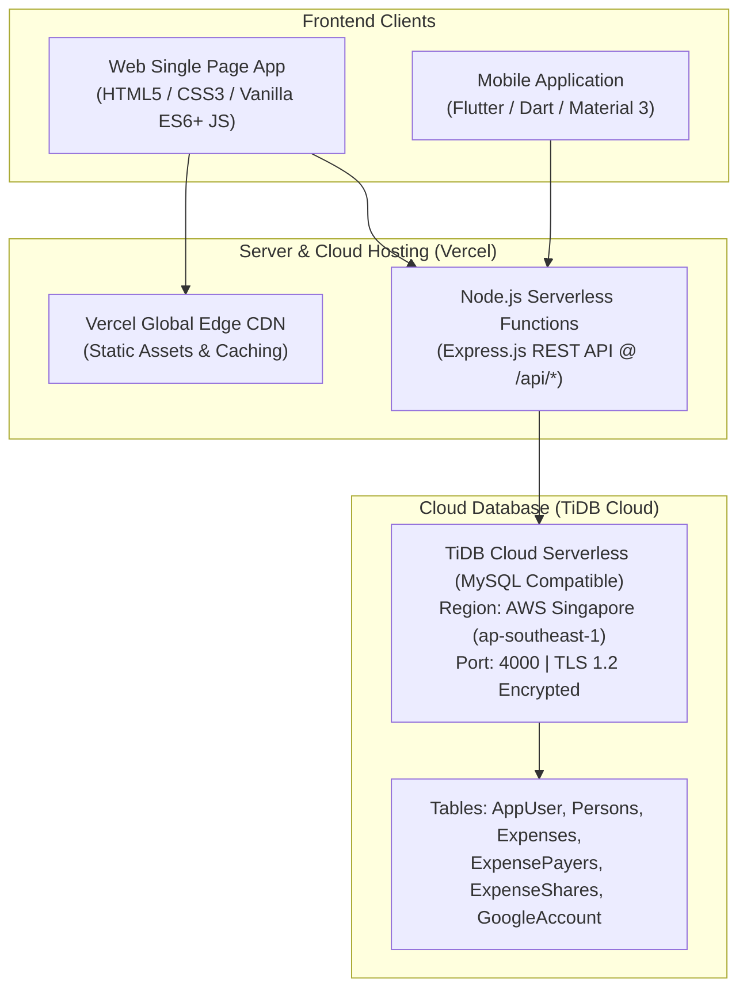
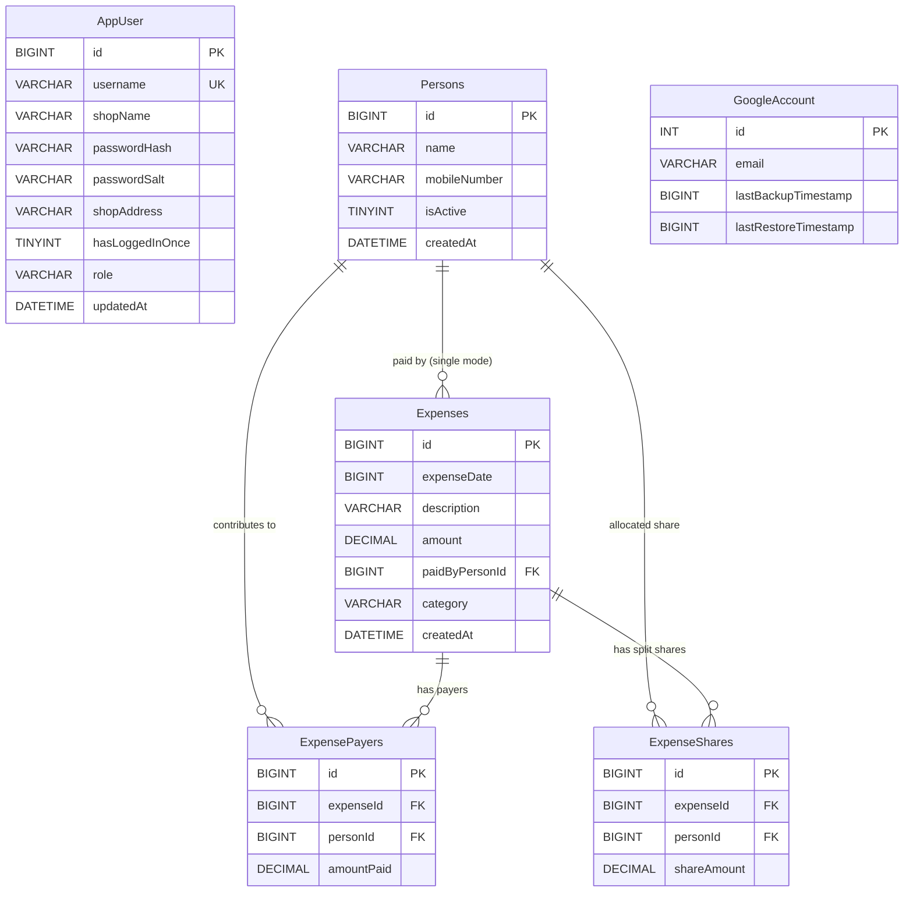

# Chaudry Mess System — Complete Technology Stack & System Architecture

This document provides a comprehensive technical overview of the **Chaudry Mess System**, including all frontend and backend programming languages, UI/UX frameworks, database design and schema, cloud hosting, and deployment infrastructure.

---

## 1. System Architecture Overview

---

## 2. Frontend Technologies

### A. Web Application (Single Page Application — SPA)
* **HTML5:** Semantic markup, dynamic modal components, accessible forms, responsive view containers.
* **CSS3:**
  * **Custom Properties (CSS Variables):** Dynamic theming supporting Dark Mode and Light Mode (`[data-theme="dark"]`).
  * **Design Tokens:** Exact color match with the Android app (`#2E5C4E` Primary, `#DFF5E4` Receivable Green, `#FBE1E1` Payable Red).
  * **Layouts:** Flexbox & CSS Grid for card grids, reports, balance summary boxes, and mobile responsiveness.
  * **Animations:** Keyframe audio visualizers, glowing AI FAB button, modal transitions.
* **Vanilla JavaScript (ES6+):**
  * **Zero Framework Overhead:** Pure JavaScript ensures instant page loading (< 100ms), 0 kB vendor library bloat, and universal compatibility across all browsers.
  * **State Management:** Reactive central application state (`state = { user, persons, expenses, activeView, ... }`).
  * **Session & View Persistence:** HTML5 `localStorage` and URL Hash routing (`#dashboard`, `#expenses`, `#reports`, `#persons`, `#settings`) preserve active view on browser refresh.
  * **Double-Click Lockout:** Concurrency guards and debounce flags prevent duplicate transactions on multi-click.
* **Browser AI Voice Assistant (Zero-Install):**
  * **Web Speech Recognition API:** Native browser speech recognition (`SpeechRecognition` / `webkitSpeechRecognition`).
  * **Bilingual NLP Engine:** Urdu (`ur-PK`), English (`en-US`), and Roman Urdu natural language token parser.
  * **Continuous Listening & Auto-Fallback:** Resilient background listening with automatic fallback and pause detection.

### B. Mobile Application
* **Programming Language:** **Dart**
* **Framework:** **Flutter SDK (v3.x)**
* **Design System:** Material Design 3 (MD3)
* **Networking:** HTTP Client package (`http`) communicating with the Vercel REST API over HTTPS.
* **Packaging:** Android APK releases (Universal APK + ABI-split 32-bit & 64-bit APKs).

---

## 3. Backend Technologies & API Layer

* **Runtime Environment:** **Node.js (v18+ / v20+)**
* **Web Framework:** **Express.js (v4.x)**
* **Architecture:** RESTful API with JSON payloads
* **Key Backend Modules:**
  * `api/index.js`: Serverless entry point for Vercel deployment.
  * `webapp/server/routes.js`: Route definitions for authentication, CRUD operations, reporting calculations, and backups.
  * `webapp/server/db.js`: Database connection pooling, query normalization, and schema migration logic.
* **Security & Authentication:**
  * **Password Security:** SHA-256 cryptographic hashing with unique random salts.
  * **Role-Based Access Control (RBAC):** Admin (`admin`) with full management and deletion rights vs. Standard User (`user`) with read/entry privileges.
  * **SQL Injection Prevention:** 100% Parameterized queries with prepared statements.

---

## 4. Database Architecture & Schema Design

### A. Database Specifications & Location
* **Database Engine:** **TiDB Cloud Serverless** (Distributed, MySQL-compatible HTAP cloud database)
* **Cloud Provider & Region:** **AWS Asia Pacific — Singapore (`ap-southeast-1`)**
* **Host Address:** `gateway01.ap-southeast-1.prod.aws.tidbcloud.com`
* **Port:** `4000`
* **Database Name:** `ChaudryMessDB`
* **Security & Encryption:** Enforced TLS 1.2+ SSL connection (`mysql2/promise` with SSL verification).

### B. Entity-Relationship Diagram (ERD)

### C. Tables & Schema Description

1. **`AppUser`:** Stores application credentials, roles (`admin` / `user`), password hashes, salts, and shop header details.
2. **`Persons`:** Stores mess members/roommates with names, WhatsApp mobile numbers, and active/inactive status.
3. **`Expenses`:** Master transaction table recording expense timestamp (epoch millis), description, total amount, primary payer ID, and category (`Breakfast`, `Lunch`, `Dinner`, `Payment`, `Other`).
4. **`ExpensePayers`:** Supports single-payer and multi-payer expense contributions.
5. **`ExpenseShares`:** Records individual allocated debits (both equal split and custom person-by-person amounts).
6. **`GoogleAccount`:** Tracks backup and cloud synchronization metadata.

### D. Double-Entry Settlement Mechanism (Payments)
Payment transfers (e.g., Ali pays Rs. 2,000 to Shahzaib) use atomic SQL transactions:
* An expense row is created with category `'Payment'`.
* An `ExpensePayers` record is created for the payer (credit: increases `totalPaid`).
* An `ExpenseShares` record is created for the receiver (debit: increases `totalShare`).
* Ledger balance formula:
  $$\text{Net Balance} = \text{Total Paid} - \text{Total Share}$$
  * $\text{Net Balance} > 0 \implies \text{Receivable (Green)}$
  * $\text{Net Balance} < 0 \implies \text{Payable (Red)}$

---

## 5. Server Hosting & CI/CD Deployment

| Component | Detail |
| :--- | :--- |
| **Hosting Platform** | **Vercel** (Global Serverless & Static CDN) |
| **Production URL** | `https://chaudrymess.vercel.app` |
| **Version Control Repository** | GitHub: `faizanali2020to2021-ai/ChaudryMessSystem.git` |
| **Branch** | `main` |
| **Deployment Mechanism** | Continuous Deployment (CD) — Every Git push automatically triggers a fresh production build and zero-downtime deployment. |
| **SSL / HTTPS** | Automatic TLS Certificate managed by Vercel Edge. |
| **Static Assets** | Served from Vercel Edge Cache via `public/`. |
| **Backend API Execution** | Serverless Node.js functions routed through `api/index.js`. |

---

## 6. Summary Comparison Table

| Layer | Technology | Key Advantage |
| :--- | :--- | :--- |
| **Web Frontend** | HTML5, CSS3, Vanilla ES6+ JavaScript | Zero external runtime dependencies; extremely fast loading on any device without software installations. |
| **Mobile Frontend** | Flutter & Dart | Native-level mobile performance, unified codebase, beautiful Material 3 components. |
| **Backend API** | Node.js & Express.js | Event-driven, non-blocking I/O; seamlessly runs in Vercel Serverless environment. |
| **Database** | TiDB Cloud (MySQL-Compatible) | Cloud-native, distributed storage hosted in AWS Singapore with high availability and SSL encryption. |
| **Cloud Hosting** | Vercel Global Edge | Zero server maintenance, free automatic SSL, worldwide low latency, auto Git deployment. |
